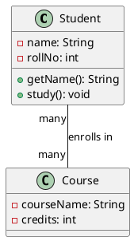

# UML Diagrams Guide

## Introduction

Unified Modeling Language (UML) is a standardized modeling language used to visualize the design of a system. For Low-Level Design, we primarily focus on class diagrams and object diagrams.

## Class Diagram

Class diagrams show the static structure of a system by depicting classes, their attributes, methods, and relationships.

### Class Representation

```
┌─────────────────────┐
│     ClassName       │  ← Class Name
├─────────────────────┤
│ - attribute1: type  │  ← Attributes
│ + attribute2: type  │
├─────────────────────┤
│ + method1(): type   │  ← Methods
│ - method2(): void   │
└─────────────────────┘
```

### Visibility Modifiers

- `+` public
- `-` private
- `#` protected
- `~` package/default

### Example

```
┌─────────────────────┐
│      Student        │
├─────────────────────┤
│ - name: String      │
│ - rollNo: int       │
│ # grade: String     │
├─────────────────────┤
│ + getName(): String │
│ + setName(): void   │
│ + study(): void     │
└─────────────────────┘
```

## Relationships in Class Diagrams

### 1. Association (Uses-A)

A relationship where one class uses another.

```
┌──────────┐            ┌──────────┐
│ Student  │───────────→│ Course   │
└──────────┘   enrolls  └──────────┘
```

**Java Code:**
```java
public class Student {
    public void enroll(Course course) {
        // Uses course
    }
}
```

### 2. Aggregation (Has-A, Weak)

A "has-a" relationship where the contained object can exist independently.

```
┌──────────┐            ┌──────────┐
│Department│◇───────────│ Teacher  │
└──────────┘    has     └──────────┘
```

**Java Code:**
```java
public class Department {
    private List<Teacher> teachers;
}
```

### 3. Composition (Has-A, Strong)

A strong "has-a" relationship where the contained object cannot exist independently.

```
┌──────────┐            ┌──────────┐
│   Car    │◆───────────│  Engine  │
└──────────┘  contains  └──────────┘
```

**Java Code:**
```java
public class Car {
    private Engine engine;
    
    public Car() {
        this.engine = new Engine();  // Engine created with Car
    }
}
```

### 4. Inheritance (Is-A)

```
┌──────────┐
│  Animal  │
└──────────┘
      △
      │
  ┌───┴───┐
  │       │
┌─────┐ ┌─────┐
│ Dog │ │ Cat │
└─────┘ └─────┘
```

**Java Code:**
```java
public class Animal { }
public class Dog extends Animal { }
public class Cat extends Animal { }
```

### 5. Implementation (Realizes)

```
┌──────────────┐
│  «interface» │
│   Drawable   │
└──────────────┘
       △
       ┆ (dashed line)
       │
   ┌───────┐
   │Circle │
   └───────┘
```

**Java Code:**
```java
public interface Drawable {
    void draw();
}

public class Circle implements Drawable {
    public void draw() { }
}
```

### 6. Dependency (Uses)

```
┌──────────┐            ┌──────────┐
│  Order   │- - - - - →│  Email   │
└──────────┘  (dashed) └──────────┘
```

**Java Code:**
```java
public class Order {
    public void process() {
        Email email = new Email();
        email.send();
    }
}
```

## Multiplicity

Indicates how many instances of one class relate to one instance of another.

```
┌──────────┐    1    *   ┌──────────┐
│ Customer │────────────│  Order   │
└──────────┘            └──────────┘
```

**Common Notations:**
- `1` - Exactly one
- `0..1` - Zero or one
- `*` or `0..*` - Zero or more
- `1..*` - One or more
- `n` - Exactly n
- `m..n` - Between m and n

## Abstract Classes and Interfaces

### Abstract Class
```
┌─────────────────────┐
│   «abstract»        │
│     Shape           │
├─────────────────────┤
│ # color: String     │
├─────────────────────┤
│ + getColor()        │
│ + draw()            │  (italic or {abstract})
└─────────────────────┘
```

### Interface
```
┌─────────────────────┐
│   «interface»       │
│     Drawable        │
├─────────────────────┤
│ + draw(): void      │
│ + resize(): void    │
└─────────────────────┘
```

## Complete Example: Library System

```
┌──────────────────┐
│     Library      │
├──────────────────┤
│ - name: String   │
├──────────────────┤
│ + addBook()      │
│ + removeBook()   │
└──────────────────┘
        │◆
        │ 1
        │
        │ *
┌──────────────────┐         *     1  ┌──────────────────┐
│      Book        │◇───────────────→│     Author       │
├──────────────────┤    written by    ├──────────────────┤
│ - isbn: String   │                  │ - name: String   │
│ - title: String  │                  │ - bio: String    │
├──────────────────┤                  ├──────────────────┤
│ + getDetails()   │                  │ + getBooks()     │
└──────────────────┘                  └──────────────────┘
        △
        │
  ┌─────┴─────┐
  │           │
┌──────┐  ┌──────┐
│EBook │  │Print │
│      │  │Book  │
└──────┘  └──────┘
```

## Design Pattern UML Examples

### Singleton Pattern
```
┌─────────────────────────┐
│      Singleton          │
├─────────────────────────┤
│ - instance: Singleton   │ (static)
├─────────────────────────┤
│ - Singleton()           │ (private)
│ + getInstance(): Singleton │ (static)
└─────────────────────────┘
```

### Factory Pattern
```
┌────────────┐
│  Product   │ «interface»
└────────────┘
      △
      │
  ┌───┴───┐
  │       │
┌────┐  ┌────┐
│ProdA│ │ProdB│
└────┘  └────┘

┌──────────────┐
│   Factory    │
├──────────────┤
│+ create(type)│
└──────────────┘
```

### Observer Pattern
```
┌──────────────┐         ┌──────────────┐
│   Subject    │◇───────→│   Observer   │
├──────────────┤    *    ├──────────────┤
│+ attach()    │         │+ update()    │
│+ detach()    │         └──────────────┘
│+ notify()    │               △
└──────────────┘               │
      △                    ┌───┴────┐
      │                    │        │
┌──────────────┐     ┌────────┐ ┌────────┐
│ConcreteSubject│    │Observer│ │Observer│
└──────────────┘     │   A    │ │   B    │
                     └────────┘ └────────┘
```

## Object Diagram

Shows instances of classes at a particular moment in time.

```
┌───────────────────────┐
│ john: Student         │
├───────────────────────┤
│ name = "John Doe"     │
│ rollNo = 101          │
└───────────────────────┘
         │
         │ enrolled in
         ▼
┌───────────────────────┐
│ cs101: Course         │
├───────────────────────┤
│ name = "Data Struct"  │
│ credits = 4           │
└───────────────────────┘
```

## Tools for Creating UML Diagrams

### Online Tools
- **draw.io** (diagrams.net) - Free, web-based
- **Lucidchart** - Professional tool
- **PlantUML** - Text-based UML
- **Creately** - Collaborative diagramming

### Desktop Tools
- **StarUML** - Professional UML tool
- **Visual Paradigm** - Enterprise modeling
- **ArgoUML** - Open source

### IDE Plugins
- IntelliJ IDEA - Built-in UML support
- Eclipse - UML2 Tools
- VS Code - PlantUML extension

## PlantUML Example



## Best Practices

1. **Keep it Simple**
   - Don't include every detail
   - Focus on important relationships

2. **Use Proper Notation**
   - Follow UML standards
   - Be consistent

3. **Clear Naming**
   - Use meaningful class and method names
   - Follow naming conventions

4. **Right Level of Detail**
   - Show enough detail for understanding
   - Not every attribute and method needed

5. **Update Regularly**
   - Keep diagrams in sync with code
   - Treat diagrams as documentation

## Common Mistakes to Avoid

1. Too much detail
2. Inconsistent notation
3. Missing relationships
4. Wrong relationship types
5. Not updating with code changes
6. Making diagrams too complex

## Conclusion

UML diagrams are essential for:
- Communicating design ideas
- Planning before coding
- Understanding existing systems
- Documenting architecture
- Team collaboration

Practice creating UML diagrams for your projects to improve your design skills!
